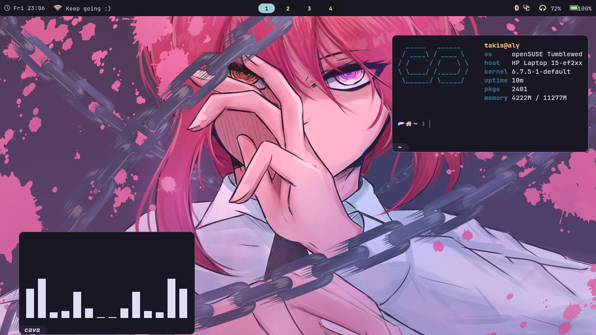

# Allyson Rowe's Dotfiles

A simple storage for my dotfiles in my linux machine.
I'm using [Stow](https://www.gnu.org/software/stow/) as my manager for dotfiles, in case that you're interested.

About me:
- Linux user | Open Suse
- Neovim
- Dead simple



## Requirements

- [Stow](https://www.gnu.org/software/stow/)
- [Fish](https://fishshell.com/)

Depending on your distro, you need to install

```
sudo zypper install fish stow
sudo dnf install fish stow
sudo pacman -S fish stow
sudo apt install fish stow
```

Then set your default shell to fish

```
chsh -s $(which fish)
```

## Packages

You can search each package later if you want to. But you'll need to install these

```
fzf neovim tmux eza hyprland wofi waybar dunst blight 

```


## Instalation

```sh
git clone https://github.com/TaliAly/dotfiles.git ~/.dotfiles
cd ~/.dotfiles
./bootstrap.sh
```

## Post Installation

- Configure with Packer to install my config [Neovim | Packer](https://github.com/wbthomason/packer.nvim?tab=readme-ov-file#quickstart)
- Update/Install [Fisher | Fisher](https://github.com/jorgebucaran/fisher?tab=readme-ov-file#installation) to Fish


## Todo's

- Add a way to save old config files (in case I'm dumb)

## Credits
- [Theprimeagen's dotfiles](https://github.com/ThePrimeagen/.dotfiles)
- [Rose pine theme](https://github.com/rose-pine)
